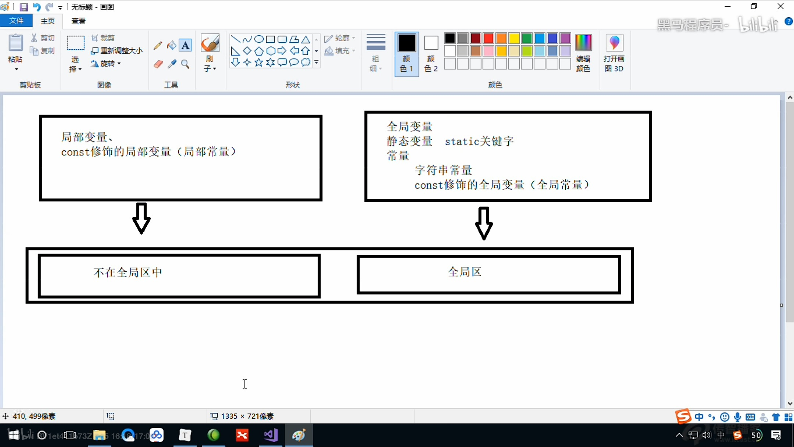

C++程序在执行时，将内存大方向划分为**4个区域**

- 代码区：存放函数体的二进制代码，由操作系统进行管理的
- 全局区：存放全局变量和静态变量以及常量
- 栈区：由编译器自动分配释放, 存放函数的参数值, 局部变量等
- 堆区：由程序员分配和释放, 若程序员不释放, 程序结束时由操作系统回收


**内存四区意义：**

不同区域存放的数据，赋予不同的生命周期, 给我们更大的灵活编程


## 1.1 程序运行前

在程序编译后，生成了exe可执行程序，**未执行该程序前**分为两个区域

**代码区：**
- 存放 CPU 执行的机器指令
- 代码区是**共享**的，共享的目的是对于频繁被执行的程序，只需要在内存中有一份代码即可
- 代码区是**只读**的，使其只读的原因是防止程序意外地修改了它的指令

**全局区：**

- 全局变量和静态变量存放在此.
- 全局区还包含了常量区, 字符串常量和其他常量也存放在此.
>该区域的数据在程序结束后由操作系统释放




**示例：**

```c++

}
```

打印结果：


总结：

* C++中在程序运行前分为全局区和代码区
* 代码区特点是共享和只读
* 全局区中存放全局变量、静态变量、常量
* 常量区中存放 const修饰的全局常量  和 字符串常量


## 1.2 程序运行后


**栈区：**

- 由编译器自动分配释放, 存放函数的参数值,局部变量等
- 注意事项：不要返回局部变量的地址，栈区开辟的数据由编译器自动释放


**示例：**

```c++
int * func()
{
	int a = 10;
	return &a;
}

int main() {

	int *p = func();

	cout << *p << endl;
	cout << *p << endl;

	system("pause");

	return 0;
}
```


**堆区：**

- 由程序员分配释放,若程序员不释放,程序结束时由操作系统回收
- 在C++中主要利用new在堆区开辟内存

**示例：**

```c++
int* func()
{
	int* a = new int(10);
	return a;
}

int main() {

	int *p = func();

	cout << *p << endl;
	cout << *p << endl;
    
	system("pause");

	return 0;
}
```


**总结：**

堆区数据由程序员管理开辟和释放

堆区数据利用new关键字进行开辟内存


## 1.3 new操作符

- C++中利用 ** new ** 操作符在堆区开辟数据
- 堆区开辟的数据，由程序员手动开辟，手动释放，释放利用操作符 ==delete==

语法：` new 数据类型`

> 利用new创建的数据，会返回该数据对应的类型的指针


**示例1： 基本语法**

```c++
int* func()
{
	int* a = new int(10);
	return a;
}

int main() {

	int *p = func();

	cout << *p << endl;
	cout << *p << endl;

	//利用delete释放堆区数据
	delete p;

	//cout << *p << endl; //报错，释放的空间不可访问

	system("pause");

	return 0;
}
```


**示例2：开辟数组**

```c++
//堆区开辟数组
int main() {

	int* arr = new int[10];

	for (int i = 0; i < 10; i++)
	{
		arr[i] = i + 100;
	}

	for (int i = 0; i < 10; i++)
	{
		cout << arr[i] << endl;
	}
	//释放数组 delete 后加 []
	delete[] arr;

	system("pause");

	return 0;
}

```